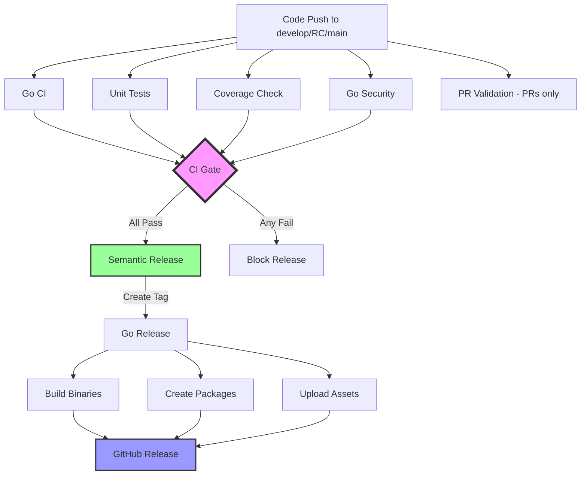
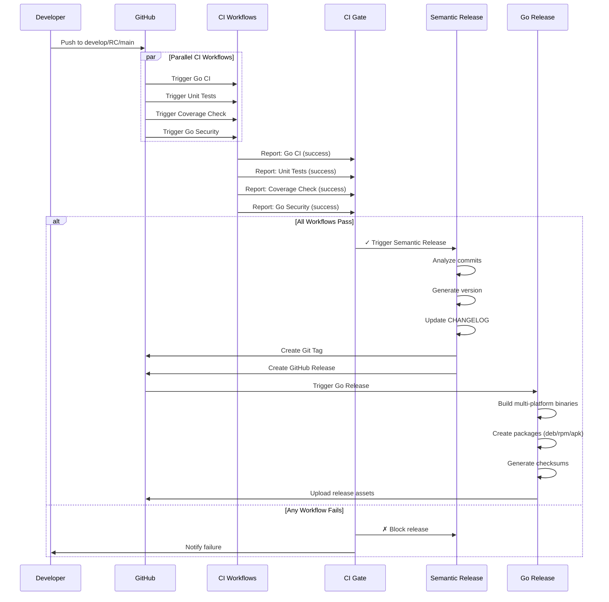
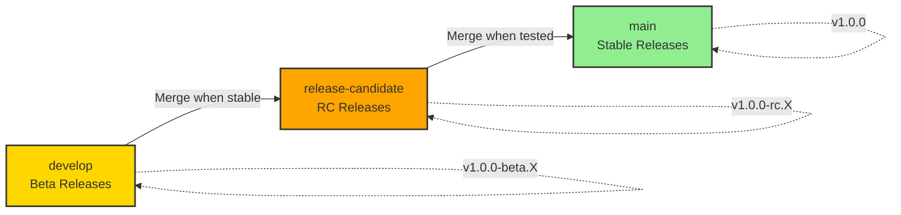
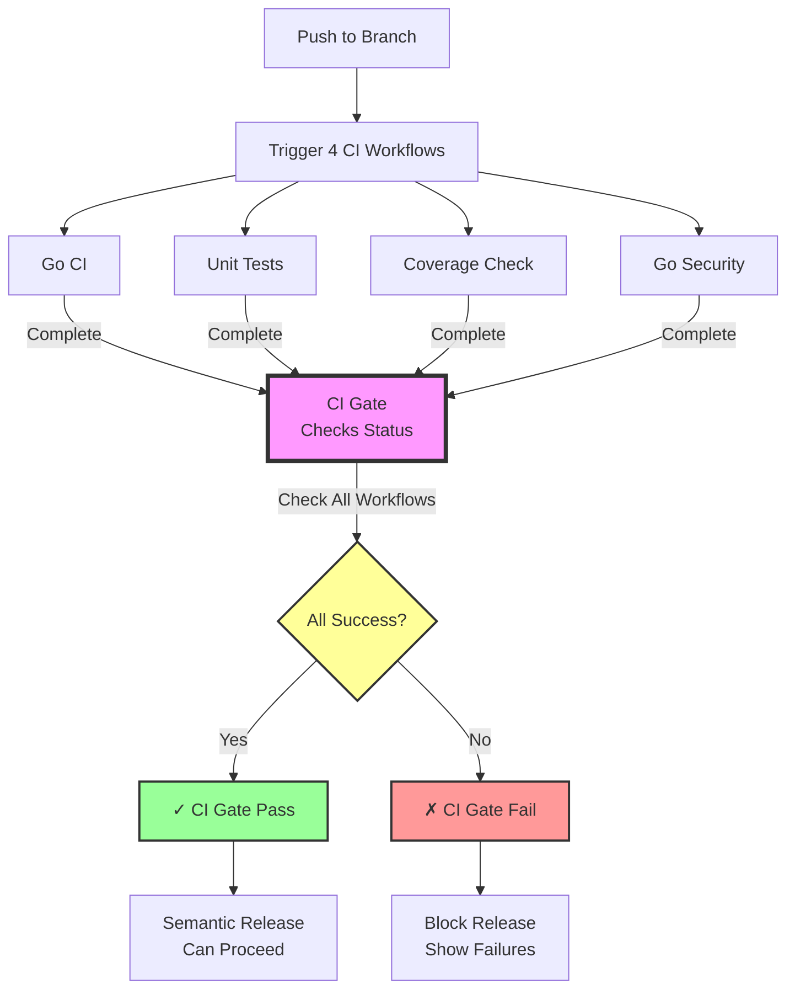
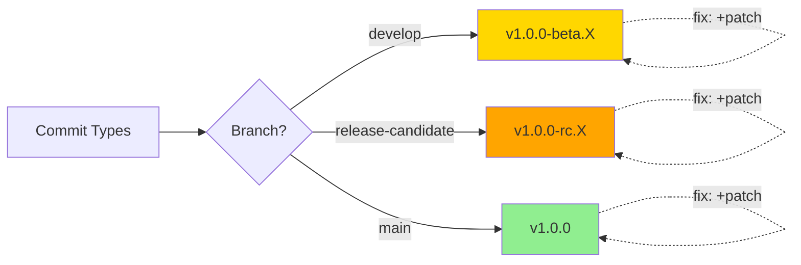
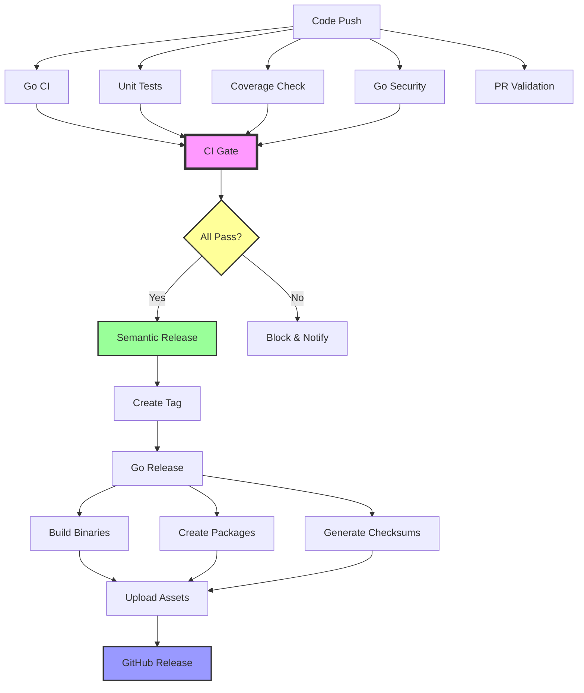

# Lerian CLI - CI/CD Pipeline Documentation

This document explains how the CI/CD pipelines work for the Lerian CLI project with visual flowcharts and comprehensive workflow descriptions.

> **Note:** The workflows were reorganized on 2025-11-22 and updated on 2025-11-25 to include CI Gate and Semantic Release automation.

## Table of Contents

- [Pipeline Architecture](#pipeline-architecture)
- [GitFlow Branching Model](#gitflow-branching-model)
- [Workflow Descriptions](#workflow-descriptions)
- [CI Gate System](#ci-gate-system)
- [Semantic Versioning](#semantic-versioning)
- [Configuration Files](#configuration-files)
- [Secrets and Variables](#secrets-and-variables)
- [Troubleshooting](#troubleshooting)
- [Best Practices](#best-practices)

## Pipeline Architecture

The Lerian CLI uses **GitHub Actions** with a sophisticated CI/CD pipeline that ensures all quality gates pass before releases.

### CI/CD Flow Diagram



### Detailed Pipeline Flow



## GitFlow Branching Model

The project follows a three-branch GitFlow strategy with automated semantic versioning.

### Branch Strategy Diagram

```mermaid
gitGraph
    commit id: "Initial"
    branch develop
    checkout develop
    commit id: "feat: Add feature A" tag: "v1.0.0-beta.1"
    commit id: "fix: Bug fix B" tag: "v1.0.0-beta.2"
    commit id: "feat: Add feature C" tag: "v1.0.0-beta.3"

    branch release-candidate
    checkout release-candidate
    merge develop tag: "v1.0.0-rc.1"
    commit id: "fix: RC bug fix" tag: "v1.0.0-rc.2"

    checkout main
    merge release-candidate tag: "v1.0.0"

    checkout develop
    commit id: "feat: New feature D" tag: "v1.0.1-beta.1"
```

### Branch Lifecycle



### Branch Details

| Branch | Purpose | Release Type | Version Pattern | Trigger |
|--------|---------|--------------|-----------------|---------|
| **develop** | Active development | Pre-release (beta) | `v1.0.0-beta.X` | Every push |
| **release-candidate** | Release testing | Pre-release (RC) | `v1.0.0-rc.X` | Merge from develop |
| **main** | Production-ready | Stable release | `v1.0.0` | Merge from RC |

### Merge Strategy

1. **Feature → develop**: Create PR, pass all checks, merge
2. **develop → release-candidate**: Fast-forward merge when ready for RC
3. **release-candidate → main**: Fast-forward merge after RC validation
4. **Hotfix → main**: Direct commit to main for critical fixes

## Workflow Descriptions

### 1. Go CI (`go-ci.yml`)

**Triggers:**
- Push to: `develop`, `release-candidate`, `main`
- Pull requests to: `develop`, `release-candidate`, `main`

**What it does:**
- **Cross-platform testing**: Tests on Go 1.24 across Ubuntu and macOS
- **Build verification**: Compiles binaries for all platforms
- **Code linting**: Runs 40+ linters with golangci-lint
- **Format check**: Verifies code formatting
- **Documentation check**: Validates documentation consistency
- **Module verification**: Ensures go.mod and go.sum are tidy

**Duration:** ~3-5 minutes

**Configuration:** Uses shared workflow from `LerianStudio/github-actions-shared-workflows`

### 2. Unit Tests (`unit-tests.yml`)

**Triggers:**
- Push to: `develop`, `release-candidate`, `main`
- Pull requests to: `develop`, `release-candidate`, `main`

**What it does:**
- **Unit test execution**: Runs all unit tests
- **Race detection**: Tests with race detector enabled
- **Fast execution**: Focused on unit tests only
- **Parallel execution**: Tests run independently

**Duration:** ~2-3 minutes

**Configuration:** Uses shared workflow from `LerianStudio/github-actions-shared-workflows`

### 3. Coverage Check (`coverage.yml`)

**Triggers:**
- Push to: `develop`, `release-candidate`, `main`
- Pull requests to: `develop`, `release-candidate`, `main`

**What it does:**
- **Coverage calculation**: Measures test coverage
- **Threshold enforcement**: Fails if coverage < 25%
- **PR comments**: Posts coverage report on PRs
- **Trend tracking**: Monitors coverage over time

**Duration:** ~2-3 minutes

**Configuration:** Minimum coverage threshold: 25%, Target: 80%+

### 4. Go Security (`go-security.yml`)

**Triggers:**
- Push to: `develop`, `release-candidate`, `main`
- Pull requests to: `develop`, `release-candidate`, `main`
- Schedule: Every Monday at 00:00 UTC
- Manual dispatch

**What it does:**
- **Gosec**: Go-specific security scanner
- **Govulncheck**: Official Go vulnerability checker
- **Nancy**: Dependency vulnerability scanner
- **Trivy**: Container and code security scanner
- **Secret scanning**: Detects leaked credentials (PR only)
- **License check**: Validates dependency licenses
- **SBOM generation**: Creates Software Bill of Materials

**Duration:** ~4-6 minutes

**Configuration:** Fails on security issues, uploads SARIF to GitHub Security

### 5. PR Validation (`pr-validation.yml`)

**Triggers:**
- Pull request events: `opened`, `synchronize`, `reopened`, `ready_for_review`

**What it does:**
- **Title validation**: Ensures conventional commit format
- **Description check**: Validates PR has adequate description (min 50 chars)
- **Auto-labeling**: Adds labels based on:
  - PR size (XS/S/M/L/XL)
  - Changed areas (auth, ledger, config, etc.)
- **Changelog reminder**: Checks if CHANGELOG.md needs update
- **Link validation**: Verifies linked issues

**Duration:** <1 minute

**Valid PR title types:** `feat`, `fix`, `docs`, `style`, `refactor`, `perf`, `test`, `chore`, `ci`, `build`, `revert`

### 6. CI Gate (`ci-gate.yml`)

**Triggers:**
- Workflow run completion of: `Go CI`, `Unit Tests`, `Go Security`, `Coverage Check`
- Branches: `develop`, `release-candidate`, `main`

**What it does:**
- **Aggregate status**: Collects results from all CI workflows
- **Validation**: Checks that ALL 4 workflows succeeded
- **Gatekeeper**: Blocks semantic-release if any workflow fails
- **Status reporting**: Provides detailed status of each workflow

**Duration:** ~5-15 seconds

**Logic:**
```javascript
// Pseudo-code of CI Gate logic
workflows = ['Go CI', 'Unit Tests', 'Go Security', 'Coverage Check']
allPassed = workflows.every(w => w.status === 'success')

if (!allPassed) {
  fail('Not all required workflows passed')
  block_semantic_release()
} else {
  success('All CI workflows passed')
  trigger_semantic_release()
}
```

### 7. Semantic Release (`semantic-release.yml`)

**Triggers:**
- Workflow run completion of: `CI Gate` (when successful)
- Manual dispatch

**What it does:**
- **Commit analysis**: Analyzes commit messages since last release
- **Version calculation**: Determines next version based on conventional commits
  - `feat:` → Minor version bump
  - `fix:` → Patch version bump
  - `BREAKING CHANGE:` → Major version bump
- **CHANGELOG generation**: Auto-generates CHANGELOG.md
- **Git tag creation**: Creates version tag (e.g., `v1.0.0-beta.1`)
- **GitHub release**: Creates GitHub release with notes
- **Branch-specific versions**:
  - `develop` → beta releases
  - `release-candidate` → RC releases
  - `main` → stable releases

**Duration:** ~1-2 minutes

**Dependencies:** `CI Gate` must pass

### 8. Go Release (`go-release.yml`)

**Triggers:**
- Release published (created by semantic-release)
- Tag push matching `v*.*.*`

**What it does:**
- **Pre-flight checks**: Runs tests before building
- **Multi-platform builds**: Creates binaries for:
  - Linux: amd64, arm64, armv7
  - macOS: amd64 (Intel), arm64 (Apple Silicon)
  - Windows: amd64
- **Package creation**:
  - Archives: `.tar.gz` (Unix), `.zip` (Windows)
  - Linux packages: `.deb`, `.rpm`, `.apk`
- **Asset upload**: Uploads all artifacts to GitHub Release
- **Checksum generation**: Creates SHA256 checksums

**Duration:** ~8-12 minutes

**Output:** GitHub release with 16+ downloadable assets

## CI Gate System

The CI Gate is a critical quality gate that ensures comprehensive validation before any release.

### How CI Gate Works



### CI Gate Benefits

1. **Atomic Quality Check**: Single point of validation for all CI workflows
2. **Prevents Partial Releases**: Won't release if any check fails
3. **Clear Status**: Shows exactly which workflows passed/failed
4. **Automated Gating**: No manual intervention needed
5. **Consistent Standards**: Same checks for all branches

### Monitored Workflows

| Workflow | Check | Failure Impact |
|----------|-------|----------------|
| **Go CI** | Code quality, builds, cross-platform | Blocks release |
| **Unit Tests** | Test passing, race detection | Blocks release |
| **Coverage Check** | Test coverage ≥ 25% | Blocks release |
| **Go Security** | Security vulnerabilities, licenses | Blocks release |

## Semantic Versioning

The project follows [Semantic Versioning 2.0.0](https://semver.org/).

### Version Format

```
v<MAJOR>.<MINOR>.<PATCH>[-<PRERELEASE>][+<BUILDMETADATA>]

Examples:
- v1.0.0          (stable release)
- v1.0.0-beta.1   (beta pre-release)
- v1.0.0-rc.2     (release candidate)
```

### Version Calculation

Based on [Conventional Commits](https://www.conventionalcommits.org/):

| Commit Type | Version Impact | Example |
|-------------|----------------|---------|
| `feat:` | Minor (+0.1.0) | `feat: add user authentication` |
| `fix:` | Patch (+0.0.1) | `fix: resolve login timeout` |
| `BREAKING CHANGE:` | Major (+1.0.0) | `feat!: redesign API` |
| `chore:`, `docs:`, etc. | No version change | `chore: update dependencies` |

### Branch-Specific Versions



## Configuration Files

### Workflow Configuration

```
.github/
├── workflows/
│   ├── go-ci.yml              # Main CI pipeline
│   ├── unit-tests.yml         # Unit test execution
│   ├── coverage.yml           # Coverage checking
│   ├── go-security.yml        # Security scanning
│   ├── pr-validation.yml      # PR validation
│   ├── ci-gate.yml            # Quality gate
│   ├── semantic-release.yml   # Automated versioning
│   └── go-release.yml         # Release automation
├── ISSUE_TEMPLATE/
├── PULL_REQUEST_TEMPLATE.md
└── labeler.yml
```

### Build Configuration

| File | Purpose | Key Settings |
|------|---------|-------------|
| `.goreleaser.yml` | Release automation | Multi-platform builds, packaging |
| `.golangci.yml` | Code linting | 40+ linters, complexity limits |
| `.releaserc.json` | Semantic release | Commit analysis, version rules |
| `Makefile` | Local development | Build, test, install commands |

## Secrets and Variables

### Required Secrets

| Secret | Purpose | Used By | Setup Required |
|--------|---------|---------|----------------|
| `LERIAN_STUDIO_MIDAZ_PUSH_BOT_APP_ID` | GitHub App authentication | Semantic Release | ✓ |
| `LERIAN_STUDIO_MIDAZ_PUSH_BOT_PRIVATE_KEY` | GitHub App private key | Semantic Release | ✓ |
| `LERIAN_CI_CD_USER_GPG_KEY` | Commit signing | Semantic Release | ✓ |
| `LERIAN_CI_CD_USER_GPG_KEY_PASSWORD` | GPG key password | Semantic Release | ✓ |
| `LERIAN_CI_CD_USER_NAME` | Committer name | Semantic Release | ✓ |
| `LERIAN_CI_CD_USER_EMAIL` | Committer email | Semantic Release | ✓ |
| `MANAGE_TOKEN` | GitHub PAT | Coverage, Release | ✓ |
| `GITHUB_TOKEN` | Automatic token | All workflows | Auto |

### Environment Variables

Automatically set during builds:

| Variable | Description | Example |
|----------|-------------|---------|
| `VERSION` | Git-based version | `v1.0.0-beta.1` |
| `COMMIT` | Git commit SHA | `1bad7eb` |
| `DATE` | Build timestamp | `2025-11-25T20:28:45Z` |
| `BUILT_BY` | Builder | `goreleaser` |

## Troubleshooting

### Common Issues

#### 1. CI Gate Fails But All Workflows Pass

**Symptom:** CI Gate shows "Not all required workflows passed"

**Cause:** Timing issue or workflow name mismatch

**Solution:**
```bash
# Check CI Gate logs
gh run view <run-id> --log | grep "workflow"

# Verify workflow names match exactly
gh run list --limit 20 | grep -E "Go CI|Unit Tests|Coverage|Security"
```

#### 2. Semantic Release Doesn't Trigger

**Symptom:** CI Gate passes but no release created

**Cause:** No releasable commits or CI Gate didn't complete

**Solution:**
- Ensure commits follow conventional format
- Check CI Gate workflow completed successfully
- Verify semantic-release workflow triggered
- Check semantic-release logs for analysis result

#### 3. Go Security Fails on Push Events

**Symptom:** TruffleHog error: "BASE and HEAD commits are the same"

**Cause:** Secret scanning requires PR with diff

**Status:** Known limitation, secret scanning only works on PRs

**Solution:** This is expected behavior; security still validated in other ways

#### 4. Coverage Below Threshold

**Symptom:** Coverage Check fails with "Coverage below 25%"

**Solution:**
```bash
# Check coverage locally
go test -cover ./...

# Get detailed coverage report
go test -coverprofile=coverage.out ./...
go tool cover -html=coverage.out

# Add tests for uncovered code
```

#### 5. Release Assets Missing

**Symptom:** GitHub release created but no binaries attached

**Cause:** Go Release workflow didn't complete

**Solution:**
```bash
# Check Go Release workflow status
gh run list --workflow=go-release.yml --limit 5

# View failure logs
gh run view <run-id> --log

# Verify .goreleaser.yml configuration
goreleaser check
```

### Debug Commands

```bash
# List recent workflow runs
gh run list --limit 20

# View specific workflow run
gh run view <run-id>

# Check workflow logs
gh run view <run-id> --log

# List releases
gh release list

# View release details
gh release view <tag>

# Check git tags
git tag -l "v*" --sort=-version:refname
```

## Best Practices

### Before Pushing Code

```bash
# 1. Run tests locally
make test

# 2. Check code coverage
go test -cover ./...

# 3. Run linter
golangci-lint run

# 4. Format code
gofmt -w .

# 5. Build locally
make build

# 6. Verify binary works
./build/bin/lerian version
```

### Commit Message Format

Follow [Conventional Commits](https://www.conventionalcommits.org/):

```
<type>[optional scope]: <description>

[optional body]

[optional footer(s)]
```

**Examples:**
```
feat(auth): add OAuth2 authentication
fix(ledger): resolve balance calculation error
docs: update CI/CD documentation
chore: bump dependencies to latest versions
```

### Pull Request Checklist

- [ ] PR title follows conventional commit format
- [ ] Description explains what and why (min 50 chars)
- [ ] All CI workflows passing
- [ ] Test coverage maintained or improved
- [ ] Documentation updated if needed
- [ ] CHANGELOG.md updated (if applicable)
- [ ] No security vulnerabilities introduced
- [ ] Code reviewed and approved

### Release Checklist

**For Beta Release (develop):**
- [ ] All CI checks passing
- [ ] Feature branch merged to develop
- [ ] Conventional commits used
- [ ] CI Gate passes
- [ ] Semantic-release creates beta tag
- [ ] Go Release builds assets

**For RC Release (release-candidate):**
- [ ] Develop branch stable and tested
- [ ] Merge develop → release-candidate
- [ ] All CI checks pass on RC
- [ ] RC testing completed
- [ ] Semantic-release creates RC tag

**For Stable Release (main):**
- [ ] RC thoroughly tested
- [ ] Merge release-candidate → main
- [ ] All CI checks pass on main
- [ ] Semantic-release creates stable tag
- [ ] Release notes reviewed
- [ ] Announcement prepared

## Workflow Dependencies Graph



## Status Badges

Add these to README.md to show pipeline status:

```markdown
[](https://github.com/lerian-studio/lerian-cli/actions/workflows/go-ci.yml)
[](https://github.com/lerian-studio/lerian-cli/actions/workflows/go-security.yml)
[](https://github.com/lerian-studio/lerian-cli/actions/workflows/coverage.yml)
[](https://github.com/lerian-studio/lerian-cli/actions/workflows/go-release.yml)
```

## Additional Resources

- [GitHub Actions Documentation](https://docs.github.com/en/actions)
- [GoReleaser Documentation](https://goreleaser.com/)
- [Conventional Commits](https://www.conventionalcommits.org/)
- [Semantic Versioning](https://semver.org/)
- [Semantic Release](https://semantic-release.gitbook.io/)
- [GitFlow Workflow](https://www.atlassian.com/git/tutorials/comparing-workflows/gitflow-workflow)

## Questions?

If you have questions about the CI/CD pipeline:
1. Check this documentation first
2. Review workflow files in `.github/workflows/`
3. Check workflow run logs: `gh run list`
4. Open a discussion in GitHub Discussions
5. Contact the maintainers

---

**Last Updated:** 2025-11-25
**Version:** 2.0.0
**Maintainers:** Lerian Studio DevOps Team
